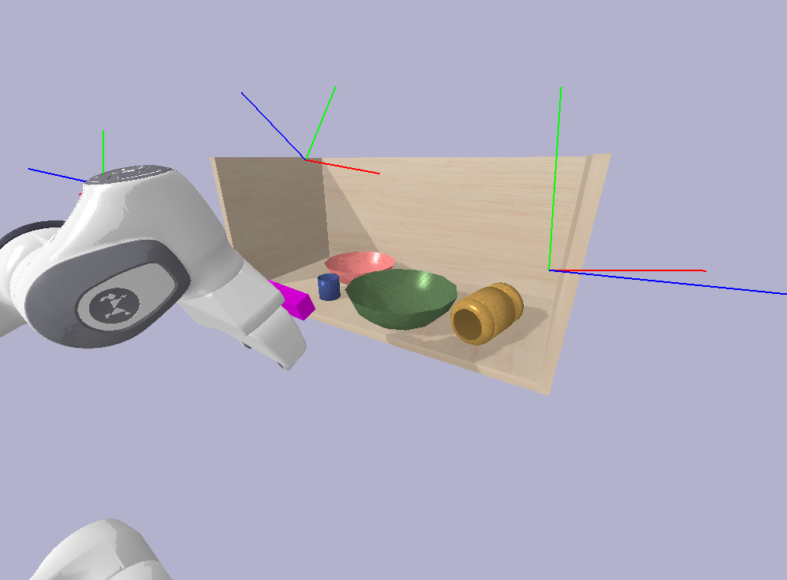

# DEF-oriCORN

This is an official code for DEF-oriCORN(submitted to IJRR).

## Environment setup instruction 
```bash
# Setup conda environment
conda env create -f environment.yaml 

# Please install pytorch3d manually.
conda activate oricorn
pip install "git+https://github.com/facebookresearch/pytorch3d.git@stable"
```

We used the modified version of [CLIP](https://github.com/openai/CLIP) with support for dense patch-level feature extraction and interpolation of the positional encoding provided by [F3RM](https://github.com/f3rm/f3rm). 

Please unarchive the preprocessed mesh files and test data in `data/archives` and place them in the following structure.
```
data
├── archives
├── NOCS
├── NOCS_val
├── PANDA
├── shelf 
├── scene_data_testset
├── texture
├── class_id.csv
└── col_datagen.py
```

You can unarchive split blocks as following
```bash
cd data/archives
zip -F NOCS.zip --out NOCS_single.zip
unzip NOCS_single.zip
zip -F NOCS_val.zip --out NOCS_val_single.zip
unzip NOCS_val_single.zip
zip -F scene_data_testset.zip --out scene_data_testset_single.zip
unzip scene_data_testset_single.zip
```


## Reproducing the result
The procedures required to reproduce the result in the paper consist of the following stages.
1. Representation dataset generation & pretraining
2. Estimation dataset generation & training
3. Evaluation
    - Estimation
    - Motion planning in simulation
4. Demo
    - Language-conditioned pick-and-place in simulation

Due to its hardware dependency, we did not include the code for real robot experiments.


### Representation(oriCORN) pretraining

We first start with the dataset generation. Once downloaded the preprocessed mesh, run the following script and it will create a new directory `${root}/data/NOCSOcc` and create `.pkl` files containing the dataset for the representation.
```bash
# You don't need to pass arguments to the Python script. We provide the setup we used as default values.
python data/col_datagen.py
```

After the dataset generation, run the following command to initiate the representation pretraining. It empirically took about 1 week with a single RTX3090 GPU. The output checkpoint will be saved under `${root}/logs`.
```bash
# You don't need to pass arguments to the Python script. We provide the setup we used as default values.
python train/pretrain.py
```

#### 👍 **Pretrained weights**
We offer the pre-trained weights we used in `${root}/checkpoints/pretraining/01152024-074410`. It is recommended that this be used to reproduce the estimation results!


### Diffusion estimatiortraining
Once you prepare the representation checkpoint, you can train the estimation module. We first need to create the dataset. Running the following script will create the estimation dataset in `${root}/data/scene_data`. Please note that the rendering is extremely slow. We used 24 machines with an RTX2080 GPU, which took a half day. It will create 300,000 samples. Each generated file will contain 500 samples with the parameters we provided.
```bash
# You don't need to pass arguments to the Python script. We provide the setup we used as default values.
python data_generation/main_datagen.py
```

After the dataset generation, run the following command to initiate estimation module training. It empirically took about 1 week with a single RTX3090 GPU. The output checkpoint will be saved under `${root}/logs_dif`.
```bash
# You don't need to pass arguments to the Python script. We provide the setup we used as default values.
python train/dm_train_multiview.py
```

#### 👍 **Pretrained weight**
We offer the pre-trained weights we used in `${root}/checkpoints/dif_model/02262024-180216_final`. It is recommended that this be used to reproduce the results in the paper!

### Evaluation

#### Estimation
To evaluate the estimation performance, run the following example. Please make sure you've setup all data files following **Environment setup instruction** section.
```bash
# You don't need to pass arguments to the Python script. We provide the setup we used as default values.
python examples/eval_examples/estimation_eval_scenedata.py 
```

#### RRT
To evaluate the motion planning in simulation, run the following example. We offer the configurations we used in `${root}/pb_examples/testset/rrt`. To evaluate the estimation performance, run the following example. Please make sure you've setup all data files following **Environment setup instruction** section.
```bash
# You don't need to pass arguments to the Python script. We provide the setup we used as default values.
python examples/pb_examples/pb_sim_RRT_eval.py
```

### Demo (Language guided pick-and-place in simulation)



> *💬 Hand me a bowl.*

We provide a demo equipped with CLIP feature in PyBullet simulation! This demo picks up a bowl and place it outside the cabinet. We use `a bowl` as a text query to CLIP. Check out the demo. Please note that the first iteration will be extremely slow due to the `jit-compilation` in Jax. This is normal.
```bash
# You don't need to pass arguments to the Python script. We provide the setup we used as default values.
python experiment/sim_language_guided_pnp.py
```


## Acknowledgements
We thank the authors of the following projects for making their code open-source:
- [CLIP](https://github.com/openai/CLIP)
- [F3RM](https://github.com/f3rm/f3rm)
